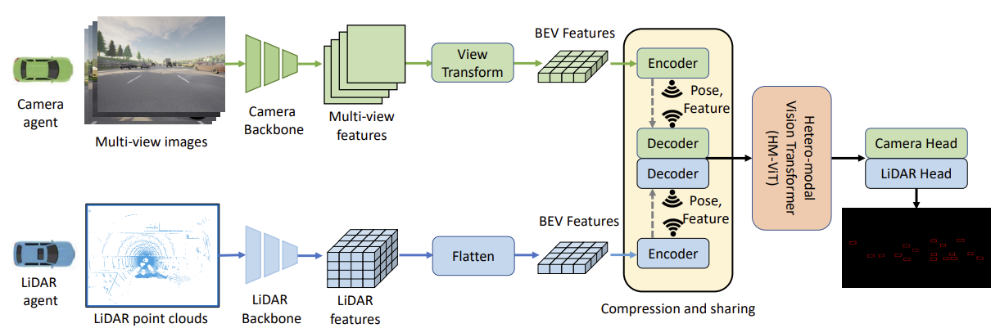

# HM-ViT
[ICCV 2023] HM-ViT: Hetero-modal Vehicle-to-Vehicle Cooperative perception with vision transformer
[](https://arxiv.org/abs/2304.10628)
[](https://arxiv.org/abs/2304.10628)
[]()

This is the official implementation of ICCV 2023 paper "HM-ViT: Hetero-modal Vehicle-to-Vehicle Cooperative perception with vision transformer".
[Hao Xiang](https://xhwind.github.io/), [Runsheng Xu](https://derrickxunu.github.io/), [Jiaqi Ma](https://mobility-lab.seas.ucla.edu/)



## Installation
```bash
# Clone repo
git clone https://github.com/XHwind/HM-ViT

cd opencood

# Setup conda environment
conda create -y --name v2xvit python=3.7

conda activate v2xvit
# pytorch >= 1.8.1, newest version can work well
conda install -y pytorch torchvision cudatoolkit=11.3 -c pytorch
# spconv 2.0 install, choose the correct cuda version for you
pip install spconv-cu113

# Install dependencies
pip install -r requirements.txt
# Install bbx nms calculation cuda version
python v2xvit/utils/setup.py build_ext --inplace

# install opencood into the environment
python setup.py develop
```


## Data
Please follow the instruction in [OPV2V](https://github.com/DerrickXuNu/OpenCOOD) to download the data. 

## Quick start

Please change the following parameters in the config to configure different hetero modes and ego types:
```yaml
camera_to_lidar_ratio: 0
ego_mode: 'lidar'
```
`camera_to_lidar_ratio` controls the ratio of collaborators's camera/LiDAR ratio. `camera_to_lidar_ratio=0` corresponds to pure lidar collaborators while `camera_to_lidar_ratio=1` is pure camera collaborators. 

`ego_mode` specifies the ego agent's modality. `ego_mode=lidar` is lidar ego agent while `ego_mode=camera` is camera ego agent, `ego_mode=mixed` will have the equal probability of each modality.  

To train with multiple gpus:
```
CUDA_VISIBLE_DEVICES=0,1,2,3 python -m torch.distributed.launch --nproc_per_node=4  --use_env opencood/tools/train_camera.py --hypes_yaml opencood/hypes_yaml/opcamera/cvt.yaml --model_dir opencood/logs/cvt_att_fuse
```

To inference: 
```
python -m opencood.tools.inference_camera --model_dir path/to/log \
    --fusion_method \
    nofusion \
    --ego_mode \
    camera \
    --camera_to_lidar_ratio \
    1 \
    --ego_mode \
    mixed \
```
